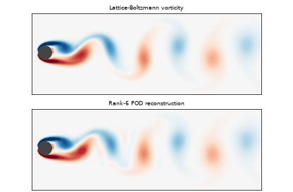
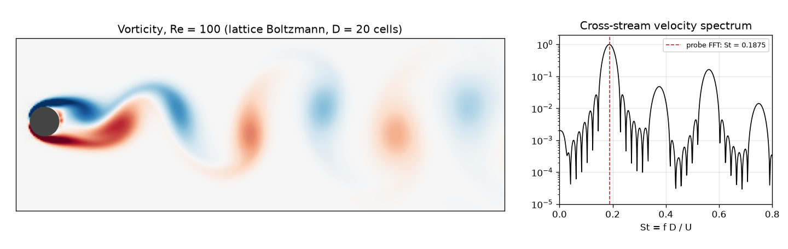
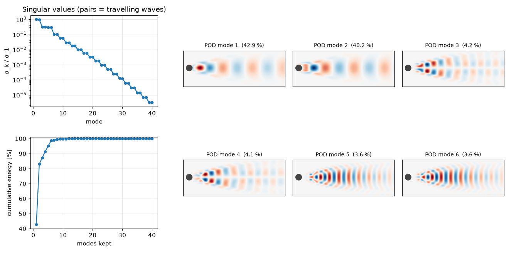
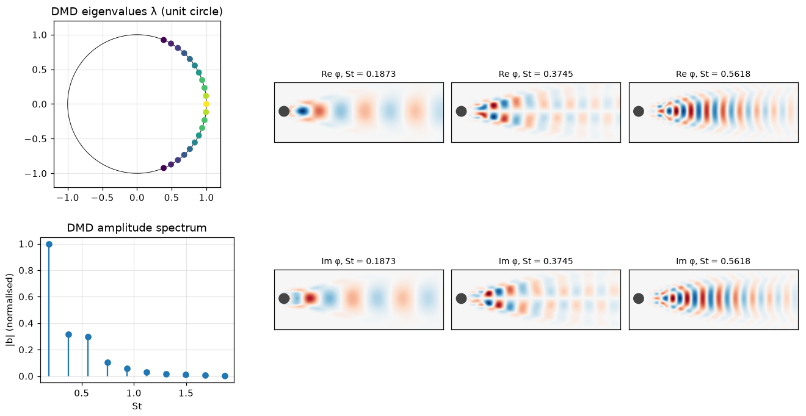
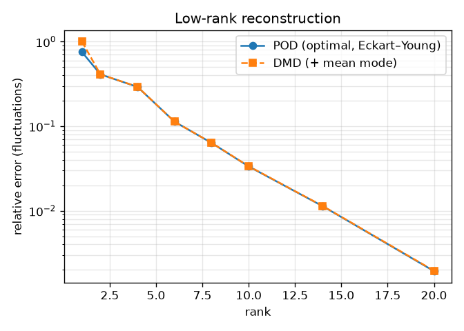

# Cylinder Wake: Lattice Boltzmann + POD (SVD) + DMD

[](https://github.com/cfdgasman/cylinder-wake-pod-dmd/actions/workflows/ci.yml)

A **von Kármán vortex street** behind a cylinder at Re = 100, simulated from scratch with a **lattice-Boltzmann** solver and then analysed with two data-driven modal decompositions:
- **Proper Orthogonal Decomposition** (POD, computed with the SVD)
- **Dynamic Mode Decomposition** (DMD)

<p align="center"></p>

## 1. Flow solver: D2Q9 lattice Boltzmann (BGK)

The particle distributions f<sub>i</sub>(**x**, t) along 9 lattice velocities **c**<sub>i</sub> obey

$$ f_i(\mathbf x + \mathbf c_i, t+1) = f_i(\mathbf x, t) - \frac{1}{\tau}\big(f_i - f_i^{\rm eq}\big), \qquad f_i^{\rm eq} = w_i\rho\Big(1 + 3\,\mathbf c_i\!\cdot\mathbf u + \tfrac92(\mathbf c_i\!\cdot\mathbf u)^2 - \tfrac32|\mathbf u|^2\Big), $$

with ρ = Σf<sub>i</sub> and ρ**u** = Σ**c**<sub>i</sub>f<sub>i</sub>. A Chapman–Enskog expansion recovers the Navier–Stokes equations with viscosity ν = (τ − ½)/3 in lattice units.

| | |
|---|---|
| Domain | 400 × 120 lattice nodes; cylinder D = 20 at (80, 62), slightly off-centre |
| Parameters | U = 0.08 (Ma ≈ 0.14), Re = UD/ν = 100, so τ = 0.548 |
| Boundaries | Equilibrium inlet, zero-gradient outlet, periodic top/bottom, **full-way bounce-back** on the cylinder |
| Run | 40 000 steps. The first 28 000 let the wake reach its periodic state; then 480 vorticity snapshots are taken every 25 steps, about 9 shedding periods |

**A lesson learned.** At Re = 100 the steady symmetric wake is unstable, but with no disturbance it can persist for a very long time. My first run produced a perfectly steady wake. The fix, standard in the literature, is a short-lived transverse velocity blob in the near wake at t = 0. It triggers shedding within about 4 000 steps.

## 2. POD via the SVD

Stack the mean-subtracted snapshots as columns, X′ = [**x**₁ − **x̄**, …, **x**<sub>m</sub> − **x̄**], and take the thin SVD:

$$ X' = U\Sigma V^{\mathsf T}. $$

- The columns of U are the POD modes. They are orthonormal and ranked by energy σ<sub>k</sub>².
- By the **Eckart–Young theorem**, truncating to rank r is the *best possible* rank-r approximation in the Frobenius norm. The test suite checks that the error equals the norm of the discarded singular values, (Σ<sub>k>r</sub> σ<sub>k</sub>²)<sup>1/2</sup>.

## 3. Exact DMD

DMD looks for a linear operator A with X₂ ≈ A X₁, where X₁ and X₂ are the snapshot sequences shifted by one step (Tu et al. 2014):

$$ X_1 = U_r\Sigma_rV_r^{*},\qquad \tilde A = U_r^{*}X_2V_r\Sigma_r^{-1},\qquad \tilde A W = W\Lambda,\qquad \Phi = X_2V_r\Sigma_r^{-1}W. $$

- Each eigenvalue λ<sub>k</sub> gives a frequency and a growth rate through ω<sub>k</sub> = ln(λ<sub>k</sub>)/Δt.
- The amplitudes b come from least squares on the first snapshot.
- The test suite recovers known frequencies and decay rates from synthetic travelling waves to 10⁻⁶.

## Results

<p align="center"></p>

| Quantity | Value |
|---|---|
| Strouhal number, probe FFT | **0.1875** |
| Strouhal number, leading DMD mode | **0.1873** |
| \|λ\| of the leading DMD mode | 1.000000 (on the unit circle: a saturated limit cycle) |
| DMD frequencies / St₁ | 1.000, 2.000, 3.000, 4.000, 5.000, … (exact harmonics) |

Two independent methods agree on St to 0.1 %. The value is higher than the unconfined St ≈ 0.165 because of the 1/6 blockage ratio. Confinement is well known to raise the shedding frequency.

### POD

<p align="center"></p>

The singular values come in **pairs**: 42.9 % + 40.2 %, then 4.2 % + 4.1 %, then 3.6 % + 3.6 %. Each pair is a sine/cosine couple describing one travelling wave, the shedding fundamental and its harmonics. **6 modes capture 98.7 %** of the fluctuation energy, and the animation shows how faithful that rank-6 reconstruction is.

### DMD

<p align="center"></p>

All DMD eigenvalues lie on the unit circle at integer multiples of the shedding frequency. Each DMD mode is a *single frequency*, whereas a POD mode can mix frequencies. For this periodic flow the two bases span nearly the same subspaces, so their reconstruction errors almost coincide:

<p align="center"></p>

## Usage

```bash
pip install -r requirements.txt
python simulate.py   # ~8 min: LBM run, writes data/wake.npz (not in git)
python analyze.py    # POD, DMD, figures and GIF in docs/
pytest               # POD / DMD checks on synthetic data
```

## References

S. Chen, G. D. Doolen, *Lattice Boltzmann method for fluid flows*, Annu. Rev. Fluid Mech. 30 (1998) 329–364.
J. H. Tu, C. W. Rowley, D. M. Luchtenburg, S. L. Brunton, J. N. Kutz, *On dynamic mode decomposition: theory and applications*, J. Comput. Dyn. 1 (2014) 391–421.
P. J. Schmid, *Dynamic mode decomposition of numerical and experimental data*, J. Fluid Mech. 656 (2010) 5–28.

## License

MIT
